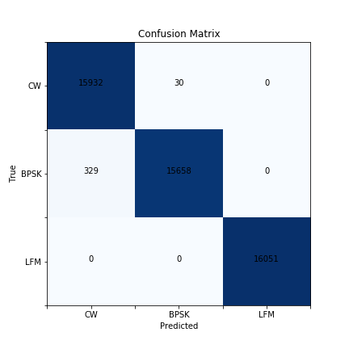

# Signal Modulation Detection using Conv1D
 Classification of signals based on its modulation

## Overview
The jupyter notebook generates signals modulated with Bi-Phase Shift Keying (BPSK) and Linear Frequency Modulation (LFM).  

Modulation | Characteristics
-----------|-----------------
BPSK       |Change in phase of signal by a magnitude of 𝜋 
LFM        |Constant change in frequency

The neural network will learn to classify 3 different input signals, Continuous Wave (CW), BPSK and LFM.
This is achieved through time-series analysis using Keras 1D convolutional networks.   

### Test Conditions
Using Scipy and Numpy, signals of various phase shifts and sweep rates were synthesised.

Characteristic               |Range
-----------------------------|------
Frequency Sampling           |1280MHz
Frequency                    |160MHZ – 600MHZ
Phase Shift                  |±𝜋
Sweep Rate                   |1MHZ – 400MHZ
SNR                          |-10dB – 10dB
Time                         |1𝜇𝑠

## Results
After 200 epochs, the accuracy was around 90%, this may be attributed to the ideal conditions of the input signal.  

 

The best weights from model training was saved and used to evaluate against a test set of signals with similar conditions.  
The model's performance is optimal. However, there is some attrition in differentiating a BPSK signal from a CW signal.  
This may be due to the similarities of the two signals in the time-domain. Hence, it is recommended to study the performance of the model by training it with data in the frequency domain.   

## Conclusion
In conclusion, a neural net to classify the modulation of the signal was developed.
Further improvements can be made by training the model on more unique data such as real signal environments.
Work could also be done to measure the sensitivity of the neural net and measures its performance over 
different SNR and sweeps rates to study the neural net's limitations and suggest improvements.  

## Dependencies
Pandas  
Numpy  
Scipy  
Matplotlib  
Keras  
Sklearn  

